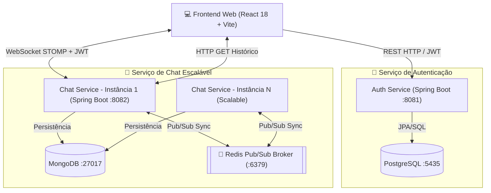

# 💬 Chat Distribuído - Plataforma de Comunicação em Tempo Real

[](https://www.oracle.com/java/)
[](https://spring.io/projects/spring-boot)
[](https://react.dev/)
[](https://vitejs.dev/)
[](https://www.docker.com/)
[](https://www.postgresql.org/)
[](https://www.mongodb.com/)
[](https://redis.io/)

Projeto prático desenvolvido para a disciplina de **Sistemas Distribuídos** (8º Período - CEFET-MG). Trata-se de uma aplicação de chat distribuído e escalável em tempo real baseada em arquitetura de **microserviços**, utilizando **WebSockets (STOMP)**, **Redis Pub/Sub** para sincronização entre nós, **MongoDB** para histórico de mensagens, **PostgreSQL** para autenticação e um **Frontend responsivo em React**.

---

## 👥 Autores

Trabalho desenvolvido em dupla por:
- **Eduardo Morais Silva Martins**
- **Maurílio Rittershaussen Novaes**

---

## 🏗️ Arquitetura do Sistema

O sistema é construído sobre uma arquitetura de microserviços desacoplada, escalável horizontalmente e resiliente:



### 🧱 Componentes do Sistema

1. **`auth-service` (Porta 8081)**:
   - Responsável pelo gerenciamento de usuários (registro e autenticação).
   - Criptografia de senhas com BCrypt.
   - Geração de tokens de acesso baseados em **JWT (JSON Web Token)**.
   - Banco de dados relacional **PostgreSQL** para persistência de credenciais.

2. **`chat-service` (Porta 8082)**:
   - Comunicação bidirecional em tempo real via **WebSockets + STOMP** (`/ws`).
   - Validação de tokens JWT no handshake das conexões WebSocket.
   - **Redis Pub/Sub**: Atua como barramento de mensagens (Message Broker) para garantir a sincronização em tempo real entre múltiplas instâncias do serviço de chat (escalabilidade horizontal).
   - **MongoDB**: Banco NoSQL orientado a documentos utilizado para guardar o histórico de mensagens públicas (1:N) e privadas (1:1).
   - Endpoints REST para consulta de histórico de conversas e lista de contatos ativos.

3. **`frontend` (Porta 5173)**:
   - Interface web moderna, reativa e intuitiva desenvolvida em **React 18** com **Vite**.
   - Integração com `@stomp/stompjs` e `sockjs-client` para manter a conexão WebSocket persistente.
   - Suporte a troca dinâmica entre salas públicas e conversas privadas diretas.
   - Design moderno com suporte a estado em tempo real e notificações visuais.

---

## 🛠️ Tecnologias Utilizadas

### Backend & Microserviços
- **Linguagem**: Java 21
- **Framework**: Spring Boot 4.0.6
- **Segurança & Auth**: Spring Security, JJWT (`io.jsonwebtoken 0.12.6`)
- **Comunicação em Tempo Real**: Spring WebSocket, STOMP Protocol
- **Mapeamento & Ferramentas**: Spring Data JPA, Spring Data MongoDB, Spring Data Redis, Lombok

### Bancos de Dados & Middleware
- **PostgreSQL 15**: Banco de dados relacional para credenciais de usuários.
- **MongoDB**: Banco de dados NoSQL para histórico de chats.
- **Redis (Alpine)**: In-Memory Message Broker para Pub/Sub e propagação de mensagens entre instâncias.

### Frontend
- **Framework**: React 18, Vite 5
- **Estilização**: CSS3 Vanilla (Design customizado e responsivo)
- **Protocolos & Clientes**: `@stomp/stompjs`, `sockjs-client`, `lucide-react`

### Infraestrutura & Testes
- **Orquestração**: Docker & Docker Compose
- **Testes**: JUnit 5, Spring Boot Test, Testes de Carga e Concorrência com WebSockets automatizados

---

## ✨ Funcionalidades Principais

- [x] **Autenticação Segura**: Cadastro e login de usuários com hash de senha e validação por Token JWT.
- [x] **Mensagens em Tempo Real**: Troca instantânea de mensagens com protocolo STOMP sobre WebSockets.
- [x] **Salas Públicas e Chats Privados**: Mensagens para todos os participantes do canal geral ou conversas privadas diretas (1:1).
- [x] **Recuperação de Histórico**: Carregamento automático de histórico de mensagens (MongoDB) ao selecionar uma conversa.
- [x] **Sincronização Distribuída (Pub/Sub)**: Distribuição transparente de mensagens via Redis entre diferentes nós do cluster backend.
- [x] **Interface Reativa**: Atualização imediata sem necessidade de recarregar a página.
- [x] **Suíte de Testes Automatizada**: Inclui testes de concorrência que simulam múltiplos clientes conectados simultaneamente enviando mensagens no barramento.

---

## 🚀 Como Executar o Projeto

### 📋 Pré-requisitos
Certifique-se de ter instalado em sua máquina:
- [Docker Desktop](https://www.docker.com/products/docker-desktop/) e **Docker Compose**
- [JDK 21](https://www.oracle.com/java/technologies/downloads/#java21) (caso vá rodar os microserviços Java nativamente)
- [Node.js 22+](https://nodejs.org/) (caso vá rodar o frontend nativamente)
- Maven 3.8+ (opcional, o projeto possui suporte a build Docker/Maven)

---

### 1️⃣ Subindo a Infraestrutura com Docker

Na raiz do projeto (`ChatDistribuido`), execute o Docker Compose para subir os bancos de dados, o Redis e a aplicação Frontend:

```bash
docker-compose up -d
```

Este comando iniciará:
- **PostgreSQL**: `localhost:5435`
- **MongoDB**: `localhost:27017`
- **Redis**: `localhost:6379`
- **Frontend**: `http://localhost:5173`

---

### 2️⃣ Executando o Backend (Microserviços)

#### 🔑 Serviço de Autenticação (`auth-service`)
Em um terminal, navegue até a pasta `auth-service` e execute:

```bash
cd auth-service
./mvnw spring-boot:run
```
> O serviço estará disponível em: `http://localhost:8081`

#### 💬 Serviço de Chat (`chat-service`)
Em outro terminal, navegue até a pasta `chat-service` e execute:

```bash
cd chat-service
./mvnw spring-boot:run
```
> O serviço estará disponível em: `http://localhost:8082`

---

### 3️⃣ Acessando a Aplicação Frontend

Abra o navegador e acesse:
```
http://localhost:5173
```

1. Crie uma conta na tela de registro ou faça login.
2. Abra uma janela em **Guia Anônima** ou em outro navegador, registre um segundo usuário e inicie uma conversa privada ou envie mensagens na sala geral!

---

## 📡 Endpoints da API

### 🔐 Auth Service (`http://localhost:8081`)

| Método | Endpoint | Descrição | Corpo da Requisição |
| :--- | :--- | :--- | :--- |
| `POST` | `/auth/register` | Cadastra um novo usuário | `{ "username": "user", "password": "123" }` |
| `POST` | `/auth/login` | Realiza autenticação e retorna Token JWT | `{ "username": "user", "password": "123" }` |

### 💬 Chat Service (`http://localhost:8082`)

#### REST Endpoints (Histórico & Contatos)
| Método | Endpoint | Descrição |
| :--- | :--- | :--- |
| `GET` | `/history/group/{groupId}` | Retorna histórico de mensagens de uma sala/grupo |
| `GET` | `/history/private/{user1}/{user2}` | Retorna histórico de mensagens privadas entre 2 usuários |
| `GET` | `/history/conversations/{username}` | Retorna a lista de contatos com quem o usuário já conversou |
| `GET` | `/history/count` | Retorna o total de mensagens registradas no sistema |

#### WebSocket / STOMP (`ws://localhost:8082/ws`)
| Tipo | Destino | Descrição |
| :--- | :--- | :--- |
| **Publish** | `/app/chat.sendMessage` | Envia uma nova mensagem (Pública ou Privada) |
| **Subscribe** | `/topic/public` | Tópico de transmissão para mensagens globais/públicas |
| **Subscribe** | `/user/queue/private` | Fila individual para recebimento de mensagens privadas (1:1) |

---

## 🧪 Execução de Testes Automatizados

O projeto conta com suítes de testes unitários, de integração e de **carga/concorrência com WebSockets**:

### Rodar testes do Auth Service:
```bash
cd auth-service
./mvnw test
```

### Rodar testes do Chat Service (Testes Concorrentes com STOMP):
```bash
cd chat-service
./mvnw test
```
> O teste `ChatConcurrencyLoadTests` simula 10 usuários simultâneos conectando via WebSocket, trocando mensagens em paralelo e validando a integridade dos dados salvos no MongoDB.

---

## 📁 Estrutura de Diretórios

```
ChatDistribuido/
├── auth-service/                # Microserviço de Autenticação (Spring Boot + PostgreSQL + JWT)
│   ├── src/main/java/br/cefetmg/authservice/
│   │   ├── config/              # SecurityConfig & PasswordEncoder
│   │   ├── controller/          # Endpoints HTTP (/auth/login, /auth/register)
│   │   ├── model/               # Entidade User
│   │   ├── repository/          # UserRepository (JPA)
│   │   └── service/             # Regras de Negócio e JWT Service
│   └── pom.xml
│
├── chat-service/                # Microserviço de Mensagens (Spring Boot + Mongo + Redis + WS)
│   ├── src/main/java/br/cefetmg/chatservice/
│   │   ├── config/              # WebSocketConfig & RedisConfig
│   │   ├── controller/          # WebSocket Message Mapping e REST History Controller
│   │   ├── model/               # ChatMessage, MessageType
│   │   └── repository/          # ChatMessageRepository (MongoDB)
│   ├── src/test/                # Testes de Integração e Testes de Carga Concorrentes
│   └── pom.xml
│
├── frontend/                    # Aplicação React em Tempo Real
│   ├── src/
│   │   ├── main.jsx             # Componente Principal da Interface de Chat
│   │   └── styles.css           # Estilização CSS3
│   └── package.json
│
├── docker-compose.yml           # Containerização (Postgres, Mongo, Redis, Frontend)
└── README.md                    # Documentação do Projeto
```

---

## 🎓 Créditos e Disciplina

Projeto desenvolvido para a disciplina de **Sistemas Distribuídos** da graduação do **CEFET-MG**.
